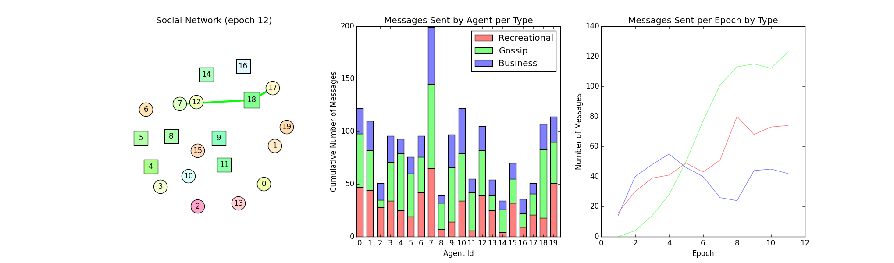

# COMP1040 Assignment 3
Semester 2, 2016

This `README.md` document describes the assignment and method of assessment.
Please read through the entire document carefully.

_This assignment is worth **20%** of your course grade.  It is due on
**Friday, 2 September 2016**._

## Overview

The previous two assignments concerned data processing and
analysis. In this assignment we will study the emergent behaviour in
social networks by simulation. Understanding the dynamics of social
networks such as Facebook and twitter is an important research topic
with many applications including improving online experience
(personalised advertising and search), optimising network bandwidth
(pre-delivery of content), tracking world events (social media),
etc. The same techniques can be applied to modelling networks in the
physical world, such as traffic flows, communication networks, and
disease transmission.

One way to simulate social networks (and physical) is via agent based
modelling. In such a model many agents are programmed with their own
simple rules. The interaction of the agents then produces complex
patterns of behaviour. This is the computational framework that we
will be using in this assignment.

To make the problem tractable in the time available for this
assignment we will make some simplifying assumptions. We will assume
that our social network consists of a number of users (agents), who
interact by sending messages to each other.

- Each user has a fixed set of friends and can only send messages to
  users in this set. The entire social network is modelled by a
  graph. A user is represented by a node in the graph, and edges
  between nodes indicate friendship relations.

- If user _A_ is friends with user _B_ then user _B_ is also friends
  with user _A_ (in the language of graph theory we say that the
  social network is undirected).

- Each user has a personality type, which can be **CHATTY** or
  **QUIET**. The personality type controls how frequenty a user sends
  new messages or forwards old messages.

- Users can only send message to adjacent nodes in the graph, i.e.,
  their friends.

- Messages have an id and a content type---we do not care about the
  exact content of the message, only its type. There are three
  content types: Recreational (**RED**), Gossip (**GREEN**), and
  Business (**BLUE**).

- The simulation proceeds in a series of epochs:

  - At each iteration a user can choose to broadcast a new message to
    all of its friends. A user can only broadcast one new message per
    epoch.

  - At each iteration a user can choose to send (forward) a previously
    received message to one or more of its friends. Multiple different
    messages can be forwarded within an epoch.
    
- A user may receive multiple copies of the same message (identified
  by the message id). However, a user should never send a message back
  to the same friend who sent the message.

- A user should never send the same message to the same friend twice.

- The user's decision to send a new message and the message's content
  type is a random decision governed by the user's personality type.

- The user's decision to forward a message is a random decision
  governed by (i) the user's personality type, (ii) the friend's
  personality type, and (iii) the message's content type.

- A user can only forward a message within the same epoch in which
  the message was received.

- Messages are delivered one epoch after they are sent.

The output of a simulation on an example network is shown below with
statistics on the number of messages sent. **CHATTY** and **QUIET**
nodes are shown as circles and squares, respectively. The colour of a
node indiciates its preferrence for sending messages of a given type,
i.e., the greener the node the more likely it is to send gossip
messages.

## Getting and Submitting the Assignment

The assignment is entirely managed from within the School's GitLab
server.  You will fork and clone the assignment to work on it and then
commit your changes and push them back to the GitLab server to submit
your solutions.  You should push back often. The latest version of
your code available at the due date will be considered as your
assignment submission.

### Forking and Cloning the Code

Before working on the assignment you must first _fork_ a copy from the COMP1040
account here: <https://gitlab.cecs.anu.edu.au/comp1040/comp1040-2016-a3>

Once you have forked the project, you will need to clone the project repository
using PyCharm IDE as you did in the previous assignments.

**Important**: Make sure your fork of the assignment is _private_ before you
start committing work to it, otherwise everyone using GitLab will be able to see
your work. You can set a Project to private via the GitLab interface:

1. Go to the version of the assignment that you've forked from your Profile page.
2. Click on the Gear drop-down box in the top right and choose "Edit Project".
3. Under "Visibility Level", select "Private".
4. Click on the "Save changes" button

### Technical Description of the Code

The code for this assignment is organised into five different files.

- `agent.py` implements user functionality in a class called `Agent`.
  The `Agent` class must contain five methods, which you will need
  to implement. See comments inside the code for details.
- `constants.py` contains useful constants for defining the user
   personality types and message types.
- `engine.py` contains the `Engine` class, which holds the graph
  defining the social network and manages message sending between
  agents. The class implements a so-called event processing
  model---each sent message triggers an event, which the engine
  processes in turn. An event is also triggered at the end of each
  epoch. The `Engine` class also keeps track of message statistics.
- `simulation.py` implements the main simulation code (using the
  `Engine` class) and visualisation.
- `test_agent.py` contains unit tests for the `Agent` class. You
  should make sure that your code passes the unit test associated
  with each task. Note, however, that just because your code passes
  a unit test does not mean that it is completely correct. You may
  need to develop your own additional tests.

The event processing model implemented by the `Engine` class _polls_
each agent to determine the action the agent wants to make in response
to certain events. For example, when the engine wants to simulate a
message being broadcast by the agent it will call the agent's
`broadcast_new_message` member function.

For most of the assignment (tasks 2--6) you will only need to modify
code in the `agent.py` file, but you should look at the code in other
files. For the advanced task you may need to modify code in other files.

### Your Tasks

You are required to implement the functionality of the `agent` class
in the Python 3 programming language. You are free to use additional
Python libraries to complete the task as long as they are bundled with
the Anaconda 3 distribution. Individual tasks are shown below. Each
task is associated with a GitLab issue, which you must close when
completing the task. `TODO` comments in the source code will also help
guide your work. A break down of marks is given next to each task.

1. Demonstrated use of GitLab                           (5%)
  + Inclusion of `NOTES.md` file
  + Commit history and issue tracking

2. Implement the `Agent` constructor `__init__`         (5%)done
3. Implement the `Agent` method `get_personality`       (5%)done
4. Implement the `Agent` method `receive_message`       (10%)done
5. Implement the `Agent` method `broadcast_new_message` (25%)done
6. Implement the `Agent` method `forward_message`       (25%)done

8. Test the simulation on different network types
   and briefly describe the different behaviours
   in your `NOTES.md` file. If you are not sure what
   to write, consider writing about how chatty the
   different agents are relative to one another, or
   whether certain types of message are more prevalent
   in some regions of a network than others, or how
   the topology of the network affects the flow of
   certain message types.                               (15%)   #write things

9. (Advanced) Plot message longevity by message type,
   i.e., how long (on average) messages persist in
   the network.                                         (10%)

### Message Sending Rules

Your agent should implement the following rules for sending messages:

- An agent should never send the same message (i.e., a message with the
  same `msg_id`) to the same neighbour twice nor should it send a message
  to the same neighbour from which the messages was received.

- At each iteration an agent may choose to broadcast a single new
  message with the following probabilities:

| Agent's Personality | **RED** Message | **GREEN** Message | **BLUE** Message | None |
| ------------------- | --------------- | ----------------- | ---------------- | ---- |
| **CHATTY**          | 30%             | 10%               | 20%              | 40%  |
| **QUIET**           | 10%             | 5%                | 10%              | 75%  |

  E.g., a **QUIET** agent will send a **GREEN** message with 5% probability.

- At each iteration and for each newly received message, an agent may
  choose to forward the message independently to each of its
  neighbours according to the following rules:

| Agent's Personality | Neighour's Personality | Message Type | Forward | Don't Fwd |
| ------------------- | ---------------------- | ------------ | ------- | --------- |
| **CHATTY**          | **CHATTY**             | **RED**      | 50%     | 50%       |
|                     |                        | **GREEN**    | 50%     | 50%       |
|                     |                        | **BLUE**     | 30%     | 70%       |
|                     | **QUIET**              | Any          | 30%     | 70%       |
|                     |                        |              |         |           |
| **QUIET**           | Any                    | **RED**      | 10%     | 90%       |
|                     | **CHATTY**             | **GREEN**    | 90%     | 10%       |
|                     |                        | **BLUE**     | 10%     | 90%       |
|                     | **QUIET**              | **GREEN**    | 30%     | 70%       |
|                     |                        | **BLUE**     | 30%     | 70%       |

  E.g., a **CHATTY** agent will forward messages of any type to a **QUIET** 
  neighbour with 30% probability.

## Copying & Plagiarism

The ANU takes plagiarism (i.e., the unattributed copying of another's work) very
seriously (see [Academic Honesty & Plagiarism][AHP]).

While we fully expect you to discuss approaches to questions with your
classmates you must never copy a complete or partial solution from someone else
and claim it as your own.

Make sure the code you write is your own. If you do get help from
someone or somewhere on the web, you must make a note (e.g., in the
code comments or a `NOTES.md` file) as to the nature of that help.

[AHP]: http://www.anu.edu.au/students/program-administration/assessments-exams/academic-honesty-plagiarism

